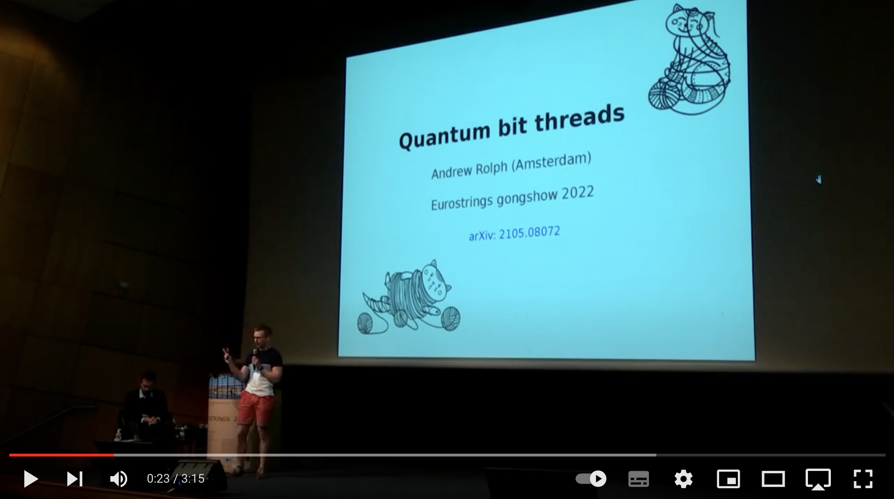

    

  <a href="https://andrewrolph.github.io">
    <button style="height:60px;width:100px;color:#3b0c6e; font-weight:bold; border-color:#3b0c6e; background-color:White">CV</button></a>
  <a href="https://andrewrolph.github.io">
    <button style="height:60px;width:100px;color:#0e1f6b; font-weight:bold; border-color:#0e1f6b; background-color:White">Home</button></a>
  <a href="https://andrewrolph.github.io/projects.html">
    <button style="height:60px;width:100px;color:#0f5f6b; font-weight:bold; border-color:#0f5f6b; background-color:White">Research</button></a>
  <a href="https://andrewrolph.github.io/aboutme.html">
    <button style="height:60px;width:100px;color: #0d782d; font-weight:bold; border-color: #0d782d; background-color:White">About</button></a>
  <a href="https://andrewrolph.github.io/talks.html">
    <button style="height:60px;width:100px;color: #30c210; font-weight:bold; border-color: #30c210; background-color:White">Talks</button></a>

         

I'm a theoretical physicist. Currently, I am a postdoc at the Universiteit van Amsterdam (University of Amsterdam).  

Below, watch me give a short presentation at Eurostrings 2022.

**Let's talk!**
 

  
Email: _andrew.d.rolph@gmail.com_

 
I'd also love to swap notes.
 
 
<form
  action="https://formspree.io/f/mwkypbvd"
  method="POST"
>
  <label style="height:60px;width:auto;color:#0e1f6b; font-weight:bold; border-color:#179965; background-color:White">
    Your email address:
    <input type="email" name="_replyto">
  </label>
   
   

  <label style="height:60px;width:auto;color:#0e1f6b; font-weight:bold; border-color:#179965; background-color:White">
    Your message:
    <textarea name="message"></textarea>
  </label>
  <!-- your other form fields go here -->
   
   
   
  <button type="submit" style="height:60px;width:100px;color:#0e1f6b; font-weight:bold; border-color:#0e1f6b; background-color:White">Send</button>
</form>

