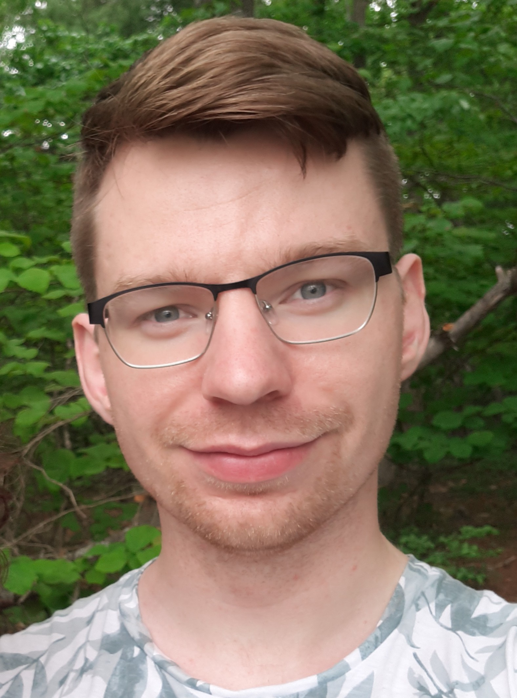

    

<!--

  <a href="https://andrewrolph.github.io">
    <button style="height:60px;width:100px;color:#0e1f6b; font-weight:bold; border-color:#0e1f6b; background-color:White">Home</button></a>
  <a href="https://andrewrolph.github.io/projects.html">
    <button style="height:60px;width:100px;color:#0f5f6b; font-weight:bold; border-color:#0f5f6b; background-color:White">Research</button></a>

-->

I'm a theoretical physicist. Currently, I am a postdoc at the Universiteit van Amsterdam (University of Amsterdam).  

Below, watch me give a short presentation at Eurostrings 2022.

**Let's talk!**
 

  
Email: _andrew.d.rolph@gmail.com_

